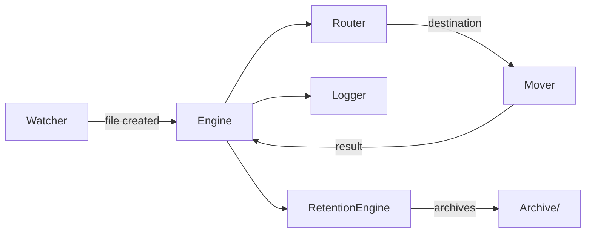

# yoinked

[](https://www.python.org/downloads/)
[](https://pytest.org)
[](LICENSE)

your downloads folder went feral. this fixes it. 🪄

Yoinked is a lightweight, local-first filesystem automation tool written in Python. It watches your Downloads folder in real time, sorts files into folders based on flexible YAML rules, and supports retention policies that archive old files. Built for people who want reliable automation without cloud or telemetry.

--

**Quick links**
- Features — see what it does
- Architecture — how it’s wired
- Install — get it running
- Usage — examples and config
- Roadmap & Contribute — how to help

## Features

- Real-time watching of a directory (Downloads) using `watchdog`
- Declarative routing rules using YAML (file patterns, metadata)
- Safe moving with duplicate resolution
- Retention policies that archive old files after X days
- Threaded workers and queues for responsive, non-blocking work
- Structured audit logging using Pydantic → JSONL
- Small footprint, no cloud, no telemetry

## Why yoinked?

- You don't want another cloud service touching your files. Yoinked runs locally and keeps control with you.
- It's focused: one job, done well — automate the Downloads folder with readable rules.
- Developer-friendly: small codebase, Pydantic schemas, easy tests and extension points.

## Architecture

High-level components:

- `watcher` — observes filesystem events
- `router` — decides destination for a file based on rules
- `engine` — coordinates routing, moving, and logging
- `mover` — performs safe filesystem moves
- `retention_engine` — archives files older than configured days
- `logger` — validates events with Pydantic and writes JSONL audit logs

Mermaid diagram (GitHub will render):



## Project structure

```
yoinked/
├─ main.py
├─ core/
│  ├─ watcher.py
│  ├─ engine.py
│  ├─ mover.py
│  ├─ logger.py
│  ├─ retention_engine.py
│  └─ state.py
├─ rules/
│  └─ router.py
├─ models/
│  └─ file_event.py
├─ utils/
│  └─ config_loader.py
tests/
README.md
requirements.txt
```

## Installation

Recommended: create a virtualenv.

```bash
python -m venv .venv
source .venv/bin/activate
pip install -r requirements.txt
```

You can run the app directly during development:

```bash
python -m yoinked.main
```

For production on macOS, use a LaunchAgent (see below) to auto-start and keep it alive.

## Usage

Start the watcher (development):

```bash
python -m yoinked.main --watch /Users/you/Downloads
```

Or run as a background agent (macOS example in INSTALLATION notes).

### Basic flow

1. `watcher` sees a new file in Downloads
2. `engine` asks `router` where it should go
3. `mover` safely moves the file to the destination
4. `logger` validates and appends a JSONL audit event

## Configuration examples

Put your routing rules in `config/rules.yml` (YAML):

```yaml
# config/rules.yml
rules:
  images:
    match:
      - "*.png"
      - "*.jpg"
    destination: "Pictures/Images"
    priority: 10

  pdfs:
    match:
      - "*.pdf"
    destination: "Documents/PDFs"
    priority: 5

  invoices:
    match:
      - "*invoice*"
    destination: "Finance/Invoices"
    priority: 20
```

Example retention policy in `config/retention.yml`:

```yaml
retention:
  Documents:
    path: "Documents"
    days: 90

  ArchivePhotos:
    path: "Pictures/Images"
    days: 365
```

## Audit log example (JSONL)

Each action is a Pydantic-validated JSON object written as a single line.

```jsonl
{"type":"sort","action":"move","file":"invoice.pdf","source":"Downloads","destination":"Finance/Invoices","status":true,"rule":"invoices","match":"*invoice*"}
```

Files are appended to `logs/audit.jsonl` by default.

## Configuration tips

- Use `priority` to resolve conflicting rules.
- Use glob patterns and substrings in `match` to keep rules simple.
- Test rules locally by dropping test files into a staging folder.

## Installation: macOS LaunchAgent (auto-start & keep alive)

Create `~/Library/LaunchAgents/com.yoinked.watcher.plist` with `ProgramArguments` pointing to your venv python and `yoinked/main.py`. Use `KeepAlive` to let launchd restart the process automatically.

## Developing & Testing

- Tests live in `tests/` and use `pytest`.
- Run `pytest -q` for the test suite.

## Roadmap

- Dashboard UI (local web dashboard)
- Tray app (macOS / Windows)
- DMG / EXE packaging for easy installs
- Optional analytics export (user opt-in only)
- Rules marketplace / community rule sharing

## Contributing

We love PRs. Keep changes small and focused. Suggested workflow:

1. Fork → branch
2. Write tests for new behavior
3. Open a PR with a clear description

Check `CONTRIBUTING.md` for more details (coming soon).

## License

MIT — see the `LICENSE` file.

---

Made with ❤️ — local-first, privacy-first automation.
